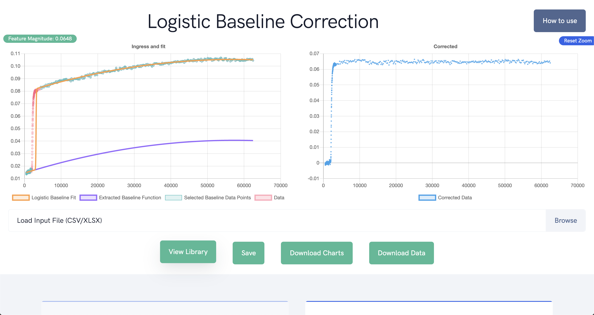

# Logistic Baseline Correction
> This is the accompanying repository for the tool hosted at [https://lbc.olickel.com](https://lbc.olickel.com).

A new method for baseline-correction is implemented here, that can account of signal-varying baselines. Please read the [How To Guide](https://lbc.olickel.com/static/tutorial.pdf) for details on using the tool, or the instructions below to run locally.



## Dependencies

Please install [Postgres](https://www.digitalocean.com/community/tutorials/how-to-install-and-use-postgresql-on-ubuntu-18-04) and [Python3](https://www.python.org/downloads/). Create a new postgres database to store the library, and install python3 to process.

## Development setup

Once the database is up and running, place the connection string along with config variables into `variables.sh` at the project root with the following content (replace the connection string with your own):

```sh
export FLASK_APP=app.py
export FLASK_DEBUG=1
export DATABASE_URL="postgresql://<username>:<password>@<host>:<port>/<db_name>"
```

## Installation

```sh
python3 -m venv venv
pip install -r requirements.txt
```

## Run

```sh
make run
```

## Meta

Jacob Schneidewind - [Papers](https://scholar.google.com/scholar?hl=en&as_sdt=0%2C5&q=jacob+schneidewind&btnG=)
Hrishi Olickel – [Writeups](https://hrishioa.github.io), [Papers](https://scholar.google.com/citations?user=CkqOqj4AAAAJ&hl=en&oi=ao)

## LBC Core Code

The core LBC code can be found in [LBC.py](LBC.py), or at [github.com/jschneidewind/LBC](https://github.com/jschneidewind/LBC).